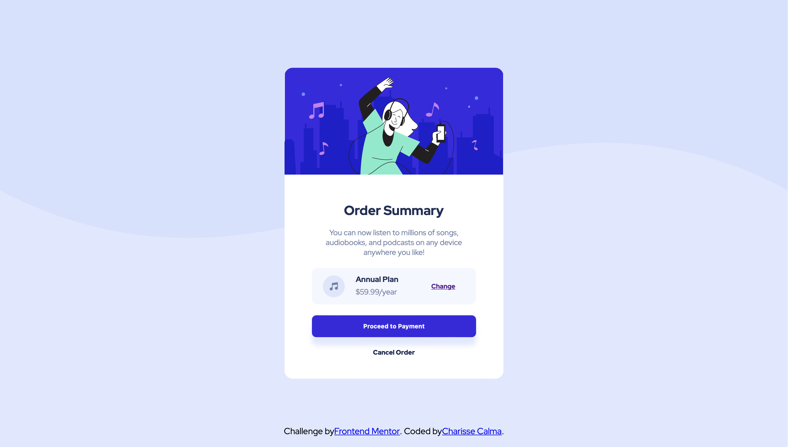

# Frontend Mentor - Order summary card solution

This is a solution to the [Order summary card challenge on Frontend Mentor](https://www.frontendmentor.io/challenges/order-summary-component-QlPmajDUj). Frontend Mentor challenges help you improve your coding skills by building realistic projects. 

## Table of contents

- [Overview](#overview)
  - [The challenge](#the-challenge)
  - [Screenshot](#screenshot)
  - [Links](#links)
- [My process](#my-process)
  - [Built with](#built-with)
  - [Useful resources](#useful-resources)
- [Author](#author)

## Overview

### The challenge

Users should be able to:

- See hover states for interactive elements

### Screenshot



### Links

- Solution URL: (https://www.frontendmentor.io/challenges/order-summary-component-QlPmajDUj)
- Live Site URL: (https://day2-puce.vercel.app)


### Built with

- Semantic HTML5 markup
- CSS custom properties
- Flexbox
- CSS Grid
- Mobile-first workflow


```html
<h1>Some HTML code I'm proud of</h1>
```
```css
.proud-of-this-css {
  color: papayawhip;
}
```
```js
const proudOfThisFunc = () => {
  console.log('🎉')
}
```

If you want more help with writing markdown, we'd recommend checking out [The Markdown Guide](https://www.markdownguide.org/) to learn more.

### Useful resources

- [resource 1](https://css-tricks.com/snippets/css/a-guide-to-flexbox/) - This resource really helped me when it came to usign the flexbox and align my designs


## Author

- Website - [Charisse Calma](charissec.me)
- Frontend Mentor - [@gamercherrie](https://www.frontendmentor.io/profile/gamercherrie)
- Twitter - [@btgrlcherrie](https://www.twitter.com/btgrlcherrie)


